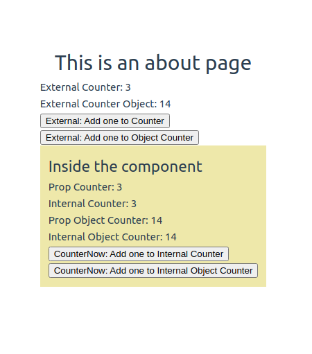

# Vue3 Prop Objects

Passings objects as props allows the child component to alter the original passed value if reactive. This is because of the nature of js where objects are passed by reference.

The main drawback of such mutations is that it allows the child component to affect parent state in a way that isn't obvious to the parent component, potentially making it more difficult to reason about the data flow in the future. As a best practice, you should avoid such mutations unless the parent and child are tightly coupled by design. In most cases, the child should emit an event to let the parent perform the mutation.

This project includes a demo of this.

